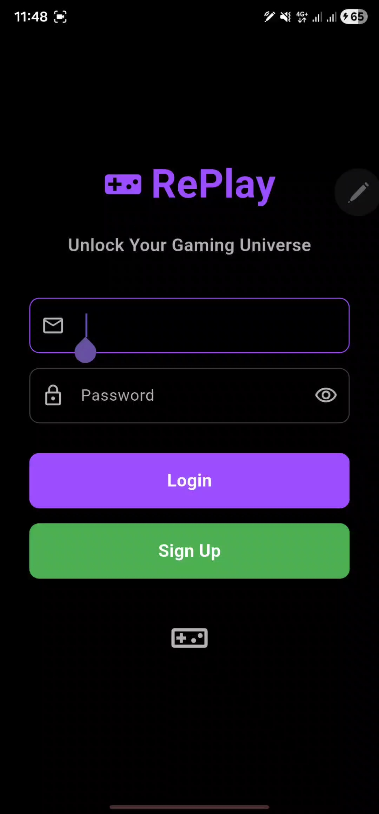
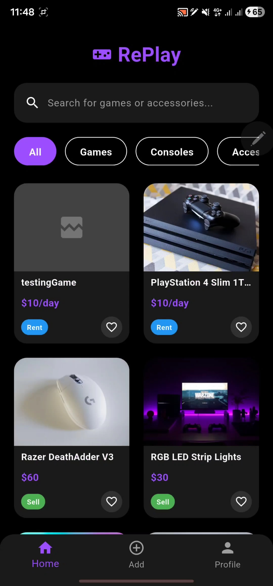
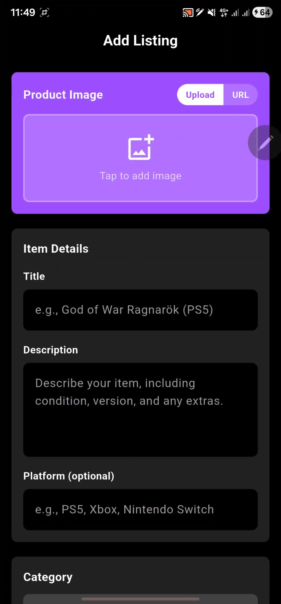
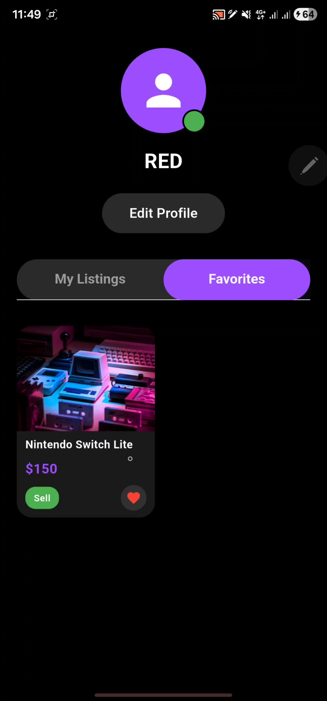

# 🎮 RePlay — Gaming Marketplace

**RePlay** is a mobile marketplace built for gamers to **buy, sell, trade, and rent** video games, consoles, and gaming accessories. Built with Flutter and Supabase as the 3rd-year Mobile Development module project at ENSIA.

> *Trade. Play. Repeat.*

---

## 📸 Screenshots

<p align="center">
  
  
  
  
</p>

---

## ✨ Features

- 🔐 **Authentication** — Email/password sign up & login via Supabase Auth
- 🏠 **Browse Marketplace** — Scrollable feed of listings with search and category filters (Games, Consoles, Accessories, Electronics)
- 🛍️ **Listings** — Create, edit, and delete your own items with images, price, platform, and listing type (Sell / Trade / Rent)
- ❤️ **Favorites** — Save items to a personal favorites list
- 👤 **Profiles** — View and edit your profile, browse your own listings and favorites
- 💬 **Contact Seller** — Reach out directly via phone call, email, or WhatsApp
- 🌗 **Dark Gaming Theme** — Custom purple-on-black UI throughout
- 🌍 **Localization** — Full English 🇬🇧 and French 🇫🇷 support, switchable in-app

---

## 🛠️ Tech Stack

| Layer | Technology |
|---|---|
| Framework | [Flutter](https://flutter.dev) (Dart) |
| State Management | [flutter_bloc](https://pub.dev/packages/flutter_bloc) (Cubit pattern) |
| Backend / Database | [Supabase](https://supabase.com) (Postgres + Auth) |
| Local Storage | `shared_preferences` |
| Media | `image_picker` |
| Contact Integrations | `url_launcher` (phone, email, WhatsApp) |
| Env Config | `flutter_dotenv` |

---

## 🏗️ Architecture

The app follows a layered, feature-organized architecture with Cubit-based state management:

```
lib/
├── core/                  # Shared constants, utils, and reusable widgets
│   ├── constants/         # Colors, strings, asset paths
│   ├── utils/              # Helpers (phone/email/WhatsApp, validators)
│   └── widgets/            # CustomButton, CustomTextField, LoadingWidget
├── data/
│   ├── datasources/         # Supabase-backed services (auth, item, favorite, user)
│   ├── models/              # UserModel, ItemModel, FavoriteItemModel
│   └── repositories/        # Bridge between Cubits and datasources
├── logic/                  # Cubits + States (auth, item, favorite, profile, language)
├── l10n/                    # Generated localization (English / French)
└── presentation/
    └── screens/             # All app screens (auth, home, item, profile, ...)
```

**Data flow:** `UI → Cubit → Repository → Service (Supabase) → Cubit emits new State → UI rebuilds`

For a full breakdown of every screen, cubit, and data flow, see:
- [`ARCHITECTURE_DOCUMENTATION.md`](ARCHITECTURE_DOCUMENTATION.md) — complete architecture & code walkthrough
- [`QUICK_REFERENCE.md`](QUICK_REFERENCE.md) — cheat sheet for screens, cubits, database schema, and helper methods

### Database schema (Supabase / Postgres)

| Table | Purpose |
|---|---|
| `users` | Account info (username, email, phone, profile image, admin flag) |
| `items` | Marketplace listings (title, description, category, type, price, owner) |
| `favorites` | Many-to-many link between users and items they've favorited |

---

## 🚀 Getting Started

### Prerequisites

- [Flutter SDK](https://docs.flutter.dev/get-started/install) (Dart ≥ 3.9)
- A [Supabase](https://supabase.com) project (free tier works)

### Setup

1. **Clone the repo**
   ```bash
   git clone https://github.com/Radhoine-Amara/RePlay.git
   cd RePlay/app
   ```

2. **Install dependencies**
   ```bash
   flutter pub get
   ```

3. **Configure environment variables**

   Copy the example file and fill in your own Supabase credentials:
   ```bash
   cp .env.example .env
   ```
   ```env
   SUPABASE_URL=your_supabase_project_url
   SUPABASE_ANON_KEY=your_supabase_anon_key
   ```
   > Find these values in your Supabase project under **Settings → API**. `.env` is gitignored — never commit it.

4. **Run the app**
   ```bash
   flutter run
   ```

---

## 🌍 Localization

RePlay supports **English** and **French**, switchable from within the app (persisted via `shared_preferences`). Translation files live in [`app/lib/l10n/`](app/lib/l10n/) (`app_en.arb`, `app_fr.arb`).

---

## 👥 Team

| Contributor |
|---|
| Mohammed Radhoine Amara |
| Bachounda Essedik |
| Imed Eddine Berghout |

Built for the **Mobile Development** module — 3rd Year, ENSIA.

---

## 📄 License

This project was built for academic purposes as part of the ENSIA Mobile Development module. No license has been assigned yet.
